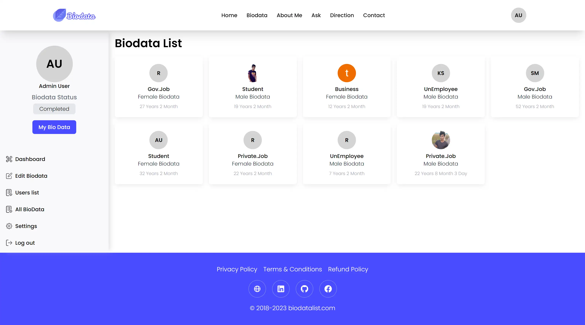
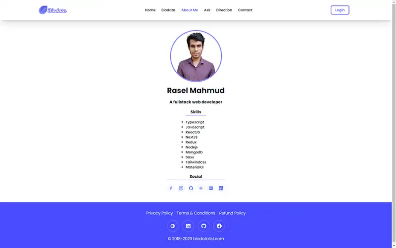
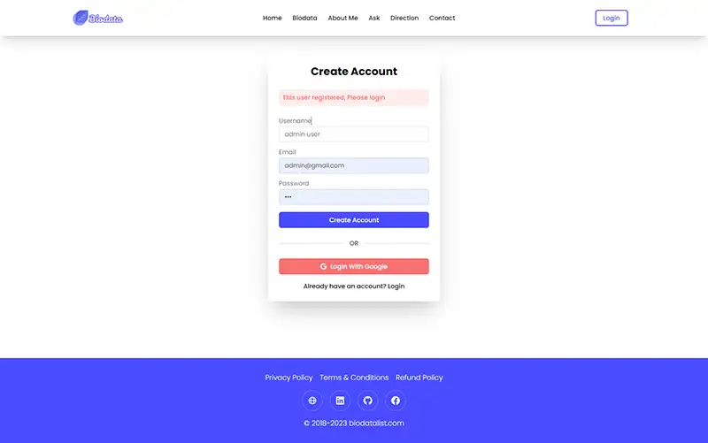

## BiodataList Management Client 

### Live: https://biodata-management.netlify.app
### Repo: https://github.com/rasel-mahmud-dev/biodatalist-management-client
### Backend: https://github.com/rasel-mahmud-dev/biodatalist-management-server

## Requirement 

### Summary
This is a biodata management services, here user can find peoples for their marriage, 
User can put their public bio data.
Also They can filter people bio data via lot of biodata attribute

### Features 
- User can filter biodata
- Login / Registration also User can login with Google Account
- All Input Validation
- User can add their biodata 
- Advance Filter biodata 
- Advance Address chooser Input multi-step country, division, district and upzila.
- Admin Dashboard panel 
- User Dashboard panel 
- Sidebar list item change dynamically when change role
- Protected Route
- Custom Accordion Component
- Custom Pagination Component

### Packages 
- Nextjs
- Redux-Toolkit + RTK query
- React-hook-form
- Tailwindcss 
- Scss

### State management 
- Redux-toolkit
- RTK query

### Routes
- Navigation 
- Login / Registration Route
- / Home page: Visitor can search biodata using filter
- /biodata/filter: Visitor filter biodata 
- /biodata/id: biodata detail 
- /users/edit-biodata: User edit biodata 
- /admin: Admin dashboard for Admin Role
- /admin/users: all users  for Admin Role
- /admin/all-biodata: all biodata  for Admin Role
- and much more...

### Some Route Preview

copy.webp)

copy.webp)

copy.webp)

copy.webp)

